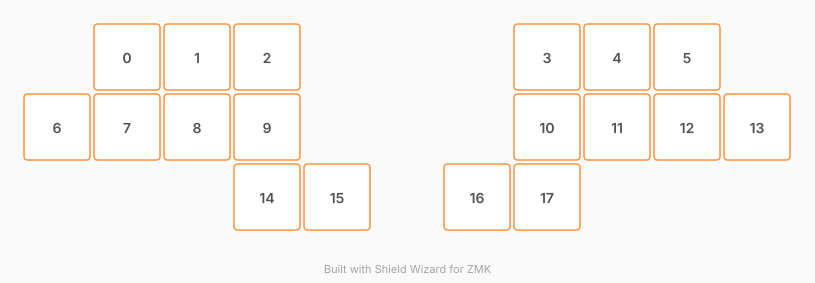

# ZMK Configuration for teenspirit

*Generated by Shield Wizard for ZMK*



Download compiled firmware from the Actions tab. <https://zmk.dev/docs/user-setup#installing-the-firmware>

Edit your keymap <https://zmk.dev/docs/keymaps>.
User keymap is located at [`config/teenspirit.keymap`](config/teenspirit.keymap).

-----

<details>
<summary>
Shield Wizard Debug Information
</summary>

In case of broken configuration, here is the Shield Wizard internal data used to generate this configuration:

Commit: 84a348b08cf4fec4a5441a46147e9a345b10ffab

```json
{"name":"teenspirit","shield":"teenspirit","dongle":false,"modules":[],"layout":[{"id":"01M32SAC6ME4Z6X24R0KG8XADB","part":0,"row":0,"col":1,"w":1,"h":1,"x":1,"y":0,"r":0,"rx":0,"ry":0},{"id":"01M32SAC6MN0F00HSXE20F3MC3","part":0,"row":0,"col":2,"w":1,"h":1,"x":2,"y":0,"r":0,"rx":0,"ry":0},{"id":"01M32SAC6MZYGFMQ6K89XMXHHT","part":0,"row":0,"col":3,"w":1,"h":1,"x":3,"y":0,"r":0,"rx":0,"ry":0},{"id":"01M32SAC6M0SX58AQQ8SWG8HRW","part":0,"row":0,"col":6,"w":1,"h":1,"x":7,"y":0,"r":0,"rx":0,"ry":0},{"id":"01M32SAC6MK036MH4PCQPFA72H","part":0,"row":0,"col":7,"w":1,"h":1,"x":8,"y":0,"r":0,"rx":0,"ry":0},{"id":"01M32SAC6MKBDN3FFB6RNQ8XB4","part":0,"row":0,"col":8,"w":1,"h":1,"x":9,"y":0,"r":0,"rx":0,"ry":0},{"id":"01M32SAC6K3X3E6TWDNFSMDMYM","part":0,"row":1,"col":0,"w":1,"h":1,"x":0,"y":1,"r":0,"rx":0,"ry":0},{"id":"01M32SAC6MZKBTWEJ2KHQ93292","part":0,"row":1,"col":1,"w":1,"h":1,"x":1,"y":1,"r":0,"rx":0,"ry":0},{"id":"01M32SAC6M5B9XQVEM434M4FPK","part":0,"row":1,"col":2,"w":1,"h":1,"x":2,"y":1,"r":0,"rx":0,"ry":0},{"id":"01M32SAC6MTY1DRZT6ZBY9HA0B","part":0,"row":1,"col":3,"w":1,"h":1,"x":3,"y":1,"r":0,"rx":0,"ry":0},{"id":"01M32SAC6MFTEM0JTWAQHDX2SB","part":0,"row":1,"col":6,"w":1,"h":1,"x":7,"y":1,"r":0,"rx":0,"ry":0},{"id":"01M32SAC6MR16BTZ19DCZKHR8M","part":0,"row":1,"col":7,"w":1,"h":1,"x":8,"y":1,"r":0,"rx":0,"ry":0},{"id":"01M32SAC6MT2E4XVY6XFYGVQZF","part":0,"row":1,"col":8,"w":1,"h":1,"x":9,"y":1,"r":0,"rx":0,"ry":0},{"id":"01M32SAC6MVWRHK48Q5W5ZYH1J","part":0,"row":1,"col":9,"w":1,"h":1,"x":10,"y":1,"r":0,"rx":0,"ry":0},{"id":"01M32SAC6MFC5EEKK10B47X0HG","part":0,"row":2,"col":3,"w":1,"h":1,"x":3,"y":2,"r":0,"rx":0,"ry":0},{"id":"01M32SAC6M7G6NN1037EVFSDZQ","part":0,"row":2,"col":4,"w":1,"h":1,"x":4,"y":2,"r":0,"rx":0,"ry":0},{"id":"01M32SAC6M2BJPDRF2QQWAJN3K","part":0,"row":2,"col":5,"w":1,"h":1,"x":6,"y":2,"r":0,"rx":0,"ry":0},{"id":"01M32SAC6MWZTK8KJEGDENP997","part":0,"row":2,"col":6,"w":1,"h":1,"x":7,"y":2,"r":0,"rx":0,"ry":0}],"parts":[{"name":"unibody","controller":"xiao_rp2040","pins":{"d4":{"usage":"kscan","kscan":"01M32V385CRJ69SNAPK92JHRS0","role":"output"},"d3":{"usage":"kscan","kscan":"01M32V385CRJ69SNAPK92JHRS0","role":"output"},"d10":{"usage":"kscan","kscan":"01M32V385CRJ69SNAPK92JHRS0","role":"output"},"d9":{"usage":"kscan","kscan":"01M32V385CRJ69SNAPK92JHRS0","role":"output"},"d5":{"usage":"kscan","kscan":"01M32V385CRJ69SNAPK92JHRS0","role":"input"},"d6":{"usage":"kscan","kscan":"01M32V385CRJ69SNAPK92JHRS0","role":"input"},"d7":{"usage":"kscan","kscan":"01M32V385CRJ69SNAPK92JHRS0","role":"input"},"d8":{"usage":"kscan","kscan":"01M32V385CRJ69SNAPK92JHRS0","role":"input"},"d1":{"usage":"kscan","kscan":"01M32V385CRJ69SNAPK92JHRS0","role":"input"}},"kscans":[{"kind":"matrix","id":"01M32V385CRJ69SNAPK92JHRS0","diodes":true}],"keys":{"01M32SAC6K3X3E6TWDNFSMDMYM":{"input":"d6","output":"d4"},"01M32SAC6ME4Z6X24R0KG8XADB":{"input":"d5","output":"d4"},"01M32SAC6MN0F00HSXE20F3MC3":{"input":"d5","output":"d3"},"01M32SAC6MZYGFMQ6K89XMXHHT":{"input":"d1","output":"d3"},"01M32SAC6M0SX58AQQ8SWG8HRW":{"input":"d1","output":"d10"},"01M32SAC6MK036MH4PCQPFA72H":{"input":"d5","output":"d10"},"01M32SAC6MKBDN3FFB6RNQ8XB4":{"input":"d5","output":"d9"},"01M32SAC6MVWRHK48Q5W5ZYH1J":{"input":"d6","output":"d9"},"01M32SAC6MZKBTWEJ2KHQ93292":{"input":"d6","output":"d3"},"01M32SAC6MT2E4XVY6XFYGVQZF":{"input":"d6","output":"d10"},"01M32SAC6M5B9XQVEM434M4FPK":{"input":"d7","output":"d4"},"01M32SAC6MFC5EEKK10B47X0HG":{"input":"d8","output":"d4"},"01M32SAC6MTY1DRZT6ZBY9HA0B":{"input":"d7","output":"d3"},"01M32SAC6M7G6NN1037EVFSDZQ":{"input":"d8","output":"d3"},"01M32SAC6MFTEM0JTWAQHDX2SB":{"input":"d7","output":"d10"},"01M32SAC6M2BJPDRF2QQWAJN3K":{"input":"d8","output":"d10"},"01M32SAC6MR16BTZ19DCZKHR8M":{"input":"d7","output":"d9"},"01M32SAC6MWZTK8KJEGDENP997":{"input":"d8","output":"d9"}},"encoders":[],"buses":{}}]}
```

</details>
